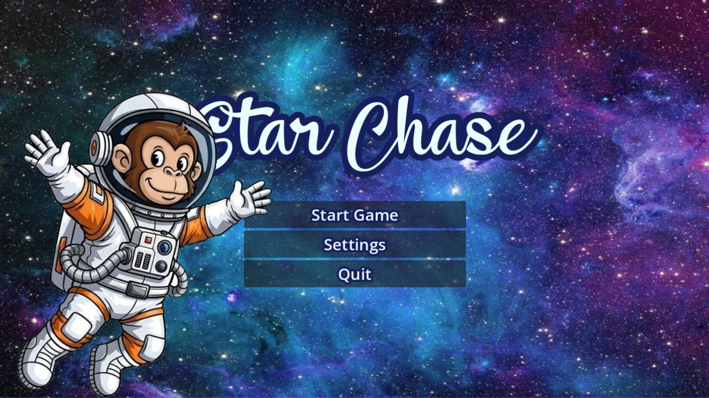
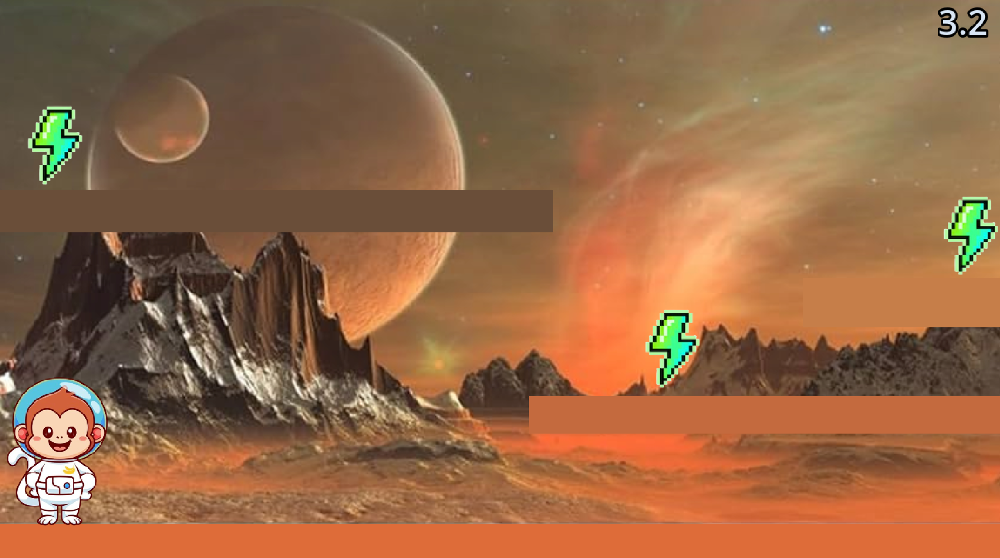
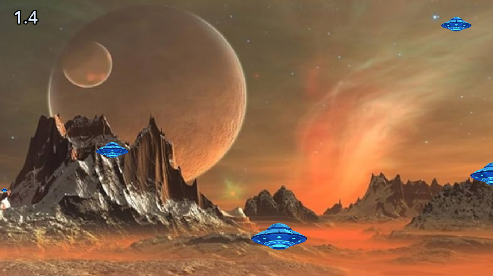
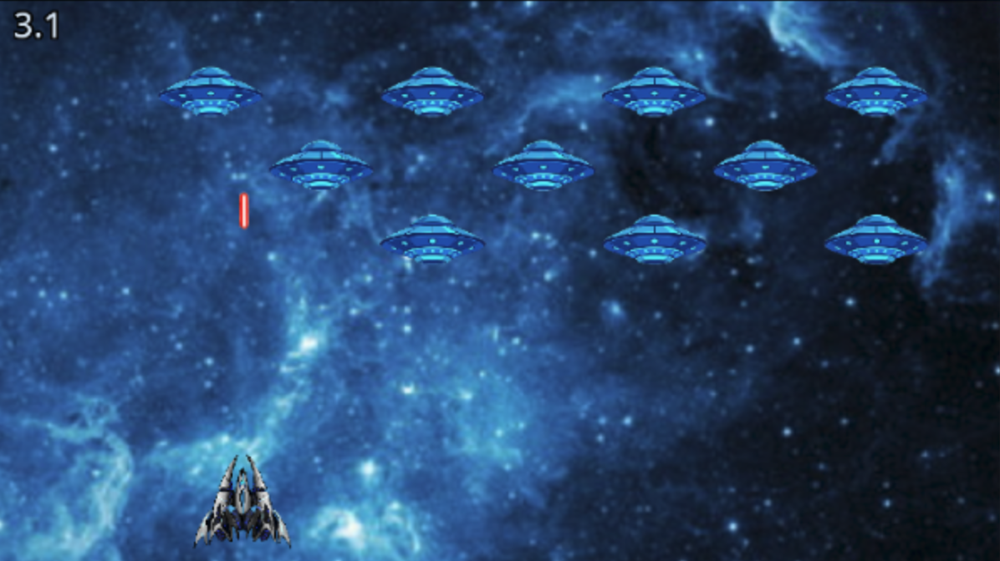
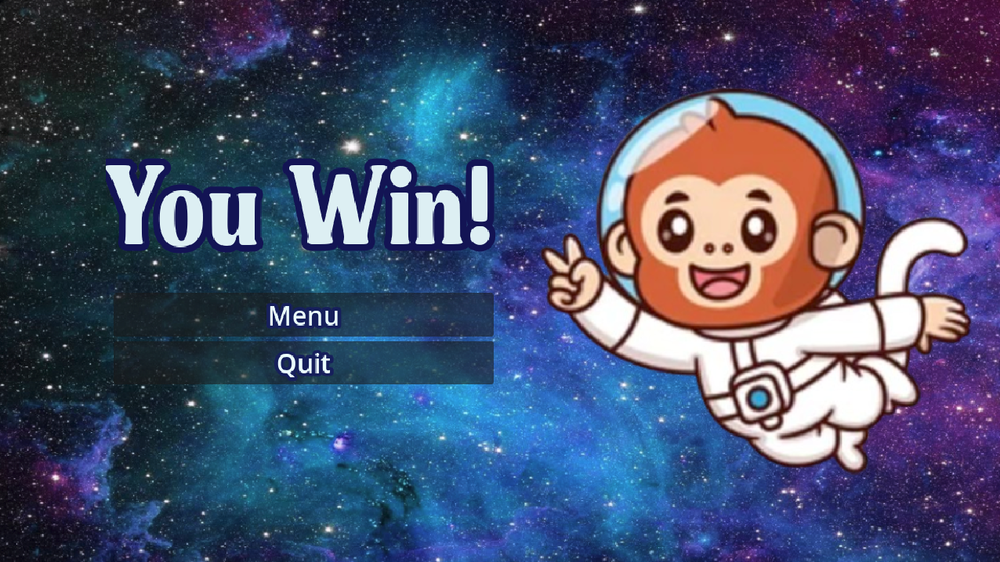
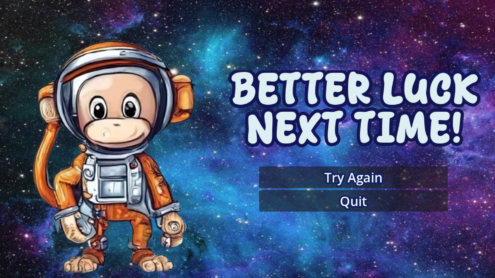

# **Star Chase**

### A short, 3 game compilation of simple yet challenging minigames.

## >> Minigame 1:

The first minigame is a platformer minigame where you have 7 seconds to collect all 3 energy lightining bolts. 

Use the arrow keys to move left and right, and the space bar to jump.

## >> Minigame 2:

Up next is a clicker. To move on, find all five UFOs and click them before time runs out.

## >> Minigame 3:

Finally, this last one was inspired by a game I once coded on Scratch, Space Invaders. 

To play, use the arrow keys to move left and right and the space bar to shoot. Take down 7 invaders before the timer ends to win!

## How to play?

Simply press [here](https://ht-astroxcalibur5315.itch.io/star-chase), then "run game," wait for the game to load, and play!

## Features:

- Three distinct minigames
- All games challenging but achievable
- Special win and lose screens

- Custom Animations
- Space themed
- Monkeys

## Credits:
- [README Formatting Guide](https://docs.github.com/en/get-started/writing-on-github/getting-started-with-writing-and-formatting-on-github/basic-writing-and-formatting-syntax)
- [The Stardance guide](https://stardance.hackclub.com/missions/wario-ware/guide)
- [Stardance Resources](https://stardance.hackclub.com/resources/great_readme)
- [AmateurWare](https://github.com/amateurtechguy/AmateurWare/blob/main/README.md?plain=1)
- [@Shreyansh (for all the help with my time-tracking issues)](https://stardance.hackclub.com/@Shreyansh)  

#### I hope you enjoy the game and good luck!  - HT
